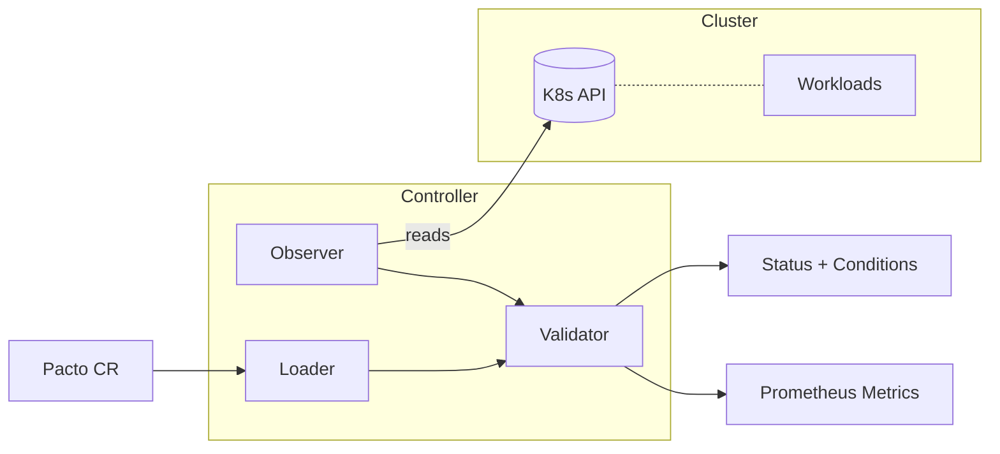

[](https://github.com/TrianaLab/pacto-operator/actions/workflows/ci.yml)
[](https://codecov.io/gh/TrianaLab/pacto-operator)
[](https://goreportcard.com/report/github.com/trianalab/pacto-operator)
[](https://github.com/TrianaLab/pacto-operator/releases/latest)
[](LICENSE)

# Pacto Operator

**Kubernetes operator for [Pacto](https://github.com/TrianaLab/pacto) service contract validation at runtime.**

The Pacto Operator watches `Pacto` custom resources and continuously validates that running workloads comply with their declared service contracts. It observes deployments, stateful sets, jobs, services, and their runtime properties — then reports compliance status through structured conditions, metrics, and Kubernetes events.

The operator is read-only and non-intrusive: it never modifies your workloads. It only reads cluster state and compares it against the contract.

---

## Why

Service contracts describe how a service should run — workload type, upgrade strategy, probes, images, storage. But nothing enforces these at runtime. Teams declare intent in a contract and deploy separately through Helm or Kustomize, with no feedback loop to detect drift.

The Pacto Operator closes this gap. It reads the contract, observes the live workload, and reports whether they match — continuously, without modifying anything in the cluster.

---

## Architecture



- **Loader** resolves contracts from OCI registries or inline YAML
- **Observer** reads runtime state from the Kubernetes API (workload kind, strategy, images, probes, storage)
- **Validator** is a pure function: contract + snapshot = result (no side effects)
- **Controller** coordinates the pipeline and updates CR status, conditions, and metrics

Six runtime checks run on each reconciliation:

| Check | Severity | What it validates |
|-------|----------|-------------------|
| WorkloadType | error | Deployment vs StatefulSet vs Job matches contract |
| StateModel | error | PVC/emptyDir presence matches contract |
| UpgradeStrategy | warning | RollingUpdate vs Recreate matches contract |
| GracefulShutdown | warning | terminationGracePeriodSeconds alignment |
| Image | warning | Container image matches contract |
| HealthTiming | warning | Probe initialDelaySeconds alignment |

## Installation

### Helm (recommended)

```bash
helm install pacto-operator oci://ghcr.io/trianalab/charts/pacto-operator \
  --namespace pacto-operator-system --create-namespace
```

The dashboard is enabled by default. See the [chart README](charts/pacto-operator/) for all configuration options including Service type, Ingress, and Gateway API HTTPRoute.

### Kustomize

```bash
make install   # Install CRDs
make deploy    # Deploy the controller
```

## Quick Start

1. Install the operator (see above).

2. Create a Pacto contract:

   ```yaml
   apiVersion: pacto.trianalab.io/v1alpha1
   kind: Pacto
   metadata:
     name: my-service
   spec:
     contractRef:
       oci: oci://ghcr.io/your-org/contracts/my-service
     target:
       serviceName: my-service
   ```

3. Check status:

   ```bash
   kubectl get pactos
   ```

   The `PHASE` column shows: `Healthy`, `Degraded`, `Invalid`, or `Reference`.

## CRDs

| CRD | Description |
|-----|-------------|
| `Pacto` | Declares a contract and optional target workload for runtime validation |
| `PactoRevision` | Immutable snapshot of a resolved contract version (auto-managed) |

A `Pacto` resource binds a contract (from an OCI registry or inline) to a target workload. On each reconciliation the controller loads the contract, observes the workload's runtime state, runs all six validation checks, and updates the CR status with structured conditions and a summary phase.

A `PactoRevision` is created automatically whenever a new contract version is resolved. Revisions are immutable and owned by their parent `Pacto` resource (garbage collected on deletion).

## Dashboard

The dashboard is enabled by default. The operator manages the dashboard lifecycle: Deployment, internal ClusterIP Service (`pacto-dashboard`), ServiceAccount, and RBAC. The dashboard image is version-locked to the Pacto library bundled into the controller — it is not user-configurable.

Network exposure is a chart-level concern, not an operator concern. The Helm chart creates a separate configurable Service for external access, with optional Ingress and Gateway API HTTPRoute support. See the [chart README](charts/pacto-operator/#dashboard) for all options.

## Metrics

The controller exposes Prometheus metrics via OpenTelemetry:

| Metric | Type | Labels | Description |
|--------|------|--------|-------------|
| `pacto_contract_compliance_status` | Gauge | service, namespace | 1 = compliant, 0 = non-compliant |
| `pacto_contract_validation_errors` | Gauge | service, namespace | Count of error-severity failures |
| `pacto_contract_validation_warnings` | Gauge | service, namespace | Count of warning-severity mismatches |
| `pacto_contract_validation_result` | Gauge | service, namespace, check | Per-check result (1=pass, 0=fail) |

Enable a Prometheus ServiceMonitor via Helm:

```yaml
metrics:
  serviceMonitor:
    enabled: true
```

Pre-built alerting rules are available in `config/prometheus/alerts.yaml`.

## Artifact Verification

All published artifacts (controller image and Helm chart) are signed with [Cosign](https://docs.sigstore.dev/cosign/overview/) using keyless OIDC signing via GitHub Actions. No pre-shared keys are required — verification uses the OIDC issuer and repository identity.

Verify the controller image:

```bash
cosign verify \
  --certificate-oidc-issuer https://token.actions.githubusercontent.com \
  --certificate-identity-regexp 'github\.com/TrianaLab/pacto-operator' \
  ghcr.io/trianalab/pacto-operator/pacto-controller:<version>
```

Verify the Helm chart:

```bash
cosign verify \
  --certificate-oidc-issuer https://token.actions.githubusercontent.com \
  --certificate-identity-regexp 'github\.com/TrianaLab/pacto-operator' \
  ghcr.io/trianalab/charts/pacto-operator:<version>
```

## Development

### Prerequisites

- Go 1.25+
- Docker
- kubectl
- [Kind](https://kind.sigs.k8s.io/) (for local Kubernetes and e2e tests)
- make

### Build and test

```bash
make build        # Build the controller binary
make test         # Run unit/integration tests (envtest)
make ci           # Run static checks + unit tests + chart validation (no cluster required)
make test-e2e     # Run e2e tests (requires Kind — creates and tears down a cluster)
make lint         # Run golangci-lint
```

`make ci` mirrors the CI pipeline's `static`, `unit-test`, and `chart` jobs. The `e2e` job requires a Kind cluster and runs separately via `make test-e2e`.

### Local development

Four single-command targets cover all local development modes:

**Local process** (operator runs on your machine, connects to current kube context):

```bash
make run                    # Operator without dashboard
make run-with-dashboard     # Operator with dashboard enabled
```

**Local Kubernetes** (operator runs inside a local cluster as a container):

```bash
make deploy-local                  # Build, install CRDs, deploy (any kube context)
make deploy-local-with-dashboard   # Build, install CRDs, deploy with dashboard
make undeploy-local                # Remove from current kube context
```

These targets work with any local Kubernetes distribution (Docker Desktop, minikube, Kind, etc.). If you use Kind, run `make kind-load` first so the image is available inside the cluster, or use the convenience target `make deploy-kind` which combines both steps.

The dashboard image is always derived from the Pacto library version in `go.mod` — it is not user-configurable.

See [CONTRIBUTING.md](CONTRIBUTING.md) for the full development guide.

## Artifacts

| Artifact | Location |
|----------|----------|
| Controller image | `ghcr.io/trianalab/pacto-operator/pacto-controller` |
| Helm chart | `oci://ghcr.io/trianalab/charts/pacto-operator` |

## License

Copyright 2026 TrianaLab.

Licensed under the [MIT License](LICENSE).
