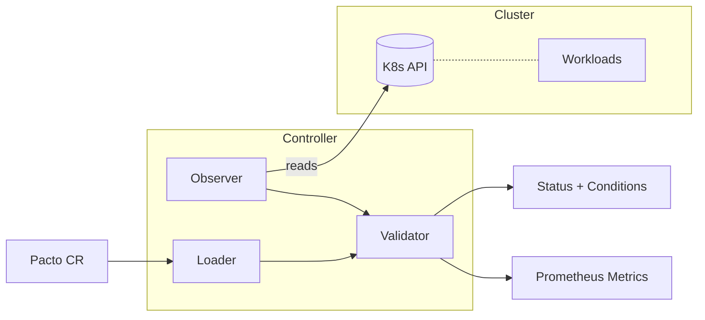

[](https://github.com/TrianaLab/pacto-operator/actions/workflows/ci.yml)
[](https://codecov.io/gh/TrianaLab/pacto-operator)
[](https://goreportcard.com/report/github.com/trianalab/pacto-operator)
[](https://github.com/TrianaLab/pacto-operator/releases/latest)
[](LICENSE)
[](https://artifacthub.io/packages/search?repo=pacto-operator)

# Pacto Operator

**Kubernetes operator that checks whether running workloads match their declared [Pacto](https://github.com/TrianaLab/pacto) service contracts.**

The operator watches `Pacto` custom resources, reads the referenced contract, observes the live workload, and reports whether they align. It is read-only and non-intrusive — it never modifies your workloads.

---

## Where it fits

[Pacto](https://github.com/TrianaLab/pacto) is a service contract system. Three components cover the full lifecycle:

| Component | Role |
|-----------|------|
| [**CLI**](https://github.com/TrianaLab/pacto) | Author, validate, diff, and publish contracts to OCI registries |
| **Operator** (this repo) | Continuously check runtime alignment between contracts and live workloads |
| [**Dashboard**](https://github.com/TrianaLab/pacto-dashboard) | Visualize the service graph, dependency tree, and compliance status |

The CLI is the authoring tool. The operator is the runtime feedback loop. The dashboard makes the results visible.

---

## Why

Teams declare intent in a contract — workload type, upgrade strategy, images, probes, storage — and deploy separately through Helm or Kustomize. Nothing connects those two sides at runtime. Contracts drift from reality silently.

The operator closes this gap. It reads the contract, observes the live workload, and reports whether they match. Continuously, without modifying anything.

---

## Architecture



Each reconciliation follows a fixed pipeline:

1. **Loader** resolves the contract from an OCI registry (auto-selecting the highest semver tag) or parses inline YAML.
2. **Observer** reads runtime state from the Kubernetes API — workload kind, strategy, images, probes, volumes, termination grace period.
3. **Validator** is a pure function: `(contract, snapshot) → result`. No side effects.
4. **Controller** coordinates the pipeline, creates `PactoRevision` snapshots for each resolved version, and updates the CR status with structured conditions, a summary phase, and metrics.

---

## Runtime checks

The following checks run on each reconciliation. These are the current built-in checks — they cover the most common contract-to-runtime mismatches, not every possible validation.

| Check | Severity | What it validates |
|-------|----------|-------------------|
| WorkloadType | error | Deployment vs StatefulSet vs Job matches contract |
| StateModel | error | PVC/emptyDir presence matches contract state model |
| UpgradeStrategy | warning | RollingUpdate vs Recreate vs OrderedReady matches contract |
| GracefulShutdown | warning | terminationGracePeriodSeconds matches contract |
| Image | warning | Container image matches contract |
| HealthTiming | warning | Probe initialDelaySeconds matches contract |

Error-severity failures set the phase to `Invalid`. Warning-severity failures set it to `Degraded`. When all checks pass, the phase is `Healthy`.

---

## CRDs

### Pacto

A `Pacto` resource binds a contract source to an optional runtime target:

- **Contract source**: OCI registry reference (`spec.contractRef.oci`) or inline YAML (`spec.contractRef.inline`). OCI references resolve to the highest semver tag automatically.
- **Target**: a Kubernetes Service (`spec.target.serviceName`) and workload (`spec.target.workloadRef`). If the workload ref is omitted, it defaults to a Deployment with the same name as the service.
- **Reference mode**: when no target is specified, the Pacto is reference-only — the contract is resolved and stored, but no runtime validation runs. Phase is `Reference`.

### PactoRevision

A `PactoRevision` is an immutable snapshot of a resolved contract version. Created automatically when a new version is resolved. Owned by the parent `Pacto` resource and garbage collected on deletion. Name pattern: `<pacto-name>-<version>-<hash>`.

---

## Quick Start

1. Install the operator (see [Installation](#installation)).

2. Create a `Pacto` resource that binds a contract to a workload:

   ```yaml
   apiVersion: pacto.trianalab.io/v1alpha1
   kind: Pacto
   metadata:
     name: my-service
   spec:
     contractRef:
       oci: ghcr.io/your-org/contracts/my-service
     target:
       serviceName: my-service
   ```

   The operator resolves the highest semver tag from the OCI registry, creates a `PactoRevision` for that version, observes the `my-service` Deployment and Service, runs all checks, and sets the status phase.

3. Check status:

   ```bash
   kubectl get pactos
   ```

   The `PHASE` column shows: `Healthy` (all checks pass), `Degraded` (warnings), `Invalid` (errors or missing resources), or `Reference` (no target).

4. Inspect conditions for details on individual checks:

   ```bash
   kubectl describe pacto my-service
   ```

---

## Installation

### Helm (recommended)

```bash
helm install pacto-operator oci://ghcr.io/trianalab/charts/pacto-operator \
  --namespace pacto-operator-system --create-namespace
```

The dashboard is enabled by default. See the [chart README](charts/pacto-operator/) for all configuration options including Service type, Ingress, and Gateway API HTTPRoute.

### Kustomize

```bash
make install   # Install CRDs
make deploy    # Deploy the controller
```

---

## Dashboard

The operator optionally manages a [Pacto Dashboard](https://github.com/TrianaLab/pacto-dashboard) instance. The dashboard provides a visual service graph showing dependencies, contract versions, and compliance status across all Pacto resources in the cluster.

The operator handles the full dashboard lifecycle: Deployment, ClusterIP Service, ServiceAccount, and RBAC. The dashboard image is version-locked to the Pacto library bundled into the controller.

Network exposure is a chart-level concern. The Helm chart creates a separate configurable Service for external access, with optional Ingress and Gateway API HTTPRoute support. See the [chart README](charts/pacto-operator/#dashboard) for details.

---

## Metrics

The controller exposes Prometheus metrics via OpenTelemetry:

| Metric | Type | Labels | Description |
|--------|------|--------|-------------|
| `pacto_contract_compliance_status` | Gauge | service, namespace | 1 = compliant, 0 = non-compliant |
| `pacto_contract_validation_errors` | Gauge | service, namespace | Count of error-severity failures |
| `pacto_contract_validation_warnings` | Gauge | service, namespace | Count of warning-severity mismatches |
| `pacto_contract_validation_result` | Gauge | service, namespace, check | Per-check result (1=pass, 0=fail) |

Enable a Prometheus ServiceMonitor via Helm:

```yaml
metrics:
  serviceMonitor:
    enabled: true
```

Pre-built alerting rules are available in `config/prometheus/alerts.yaml`.

---

## What it does NOT do

- **Enforce or block deployments.** The operator is read-only. It reports drift; it does not prevent it. Use admission webhooks or CI gates if you need enforcement.
- **Author or publish contracts.** That is the [CLI](https://github.com/TrianaLab/pacto)'s job.
- **Modify workloads.** It never patches, scales, restarts, or deletes your resources.
- **Deep protocol validation.** It does not test HTTP endpoints, validate OpenAPI responses, or run integration tests. It checks structural properties (image, strategy, probes, storage) declared in the contract.
- **Replace monitoring.** It answers "does the workload match the contract?", not "is the workload healthy?". Use it alongside — not instead of — observability tools.

---

## Artifact Verification

All published artifacts (controller image and Helm chart) are signed with [Cosign](https://docs.sigstore.dev/cosign/overview/) using keyless OIDC signing via GitHub Actions.

Verify the controller image:

```bash
cosign verify \
  --certificate-oidc-issuer https://token.actions.githubusercontent.com \
  --certificate-identity-regexp 'github\.com/TrianaLab/pacto-operator' \
  ghcr.io/trianalab/pacto-operator/pacto-controller:<version>
```

Verify the Helm chart:

```bash
cosign verify \
  --certificate-oidc-issuer https://token.actions.githubusercontent.com \
  --certificate-identity-regexp 'github\.com/TrianaLab/pacto-operator' \
  ghcr.io/trianalab/charts/pacto-operator:<version>
```

---

## Development

### Prerequisites

- Go 1.25+
- Docker
- kubectl
- [Kind](https://kind.sigs.k8s.io/) (for local Kubernetes and e2e tests)
- make

### Build and test

```bash
make build        # Build the controller binary
make test         # Run unit/integration tests (envtest)
make ci           # Run static checks + unit tests + chart validation (no cluster required)
make test-e2e     # Run e2e tests (requires Kind — creates and tears down a cluster)
make lint         # Run golangci-lint
```

`make ci` mirrors the CI pipeline's `static`, `unit-test`, and `chart` jobs. The `e2e` job requires a Kind cluster and runs separately via `make test-e2e`.

### Local development

**Local process** (operator runs on your machine, connects to current kube context):

```bash
make run                    # Operator without dashboard
make run-with-dashboard     # Operator with dashboard enabled
```

**Local Kubernetes** (operator runs inside a local cluster as a container):

```bash
make deploy-local                  # Build, install CRDs, deploy (any kube context)
make deploy-local-with-dashboard   # Build, install CRDs, deploy with dashboard
make undeploy-local                # Remove from current kube context
```

These targets work with any local Kubernetes distribution (Docker Desktop, minikube, Kind, etc.). If you use Kind, run `make kind-load` first so the image is available inside the cluster, or use `make deploy-kind` which combines both steps.

See [CONTRIBUTING.md](CONTRIBUTING.md) for the full development guide.

---

## Artifacts

| Artifact | Location |
|----------|----------|
| Controller image | `ghcr.io/trianalab/pacto-operator/pacto-controller` |
| Helm chart | `oci://ghcr.io/trianalab/charts/pacto-operator` |

## License

Copyright 2026 TrianaLab.

Licensed under the [MIT License](LICENSE).
