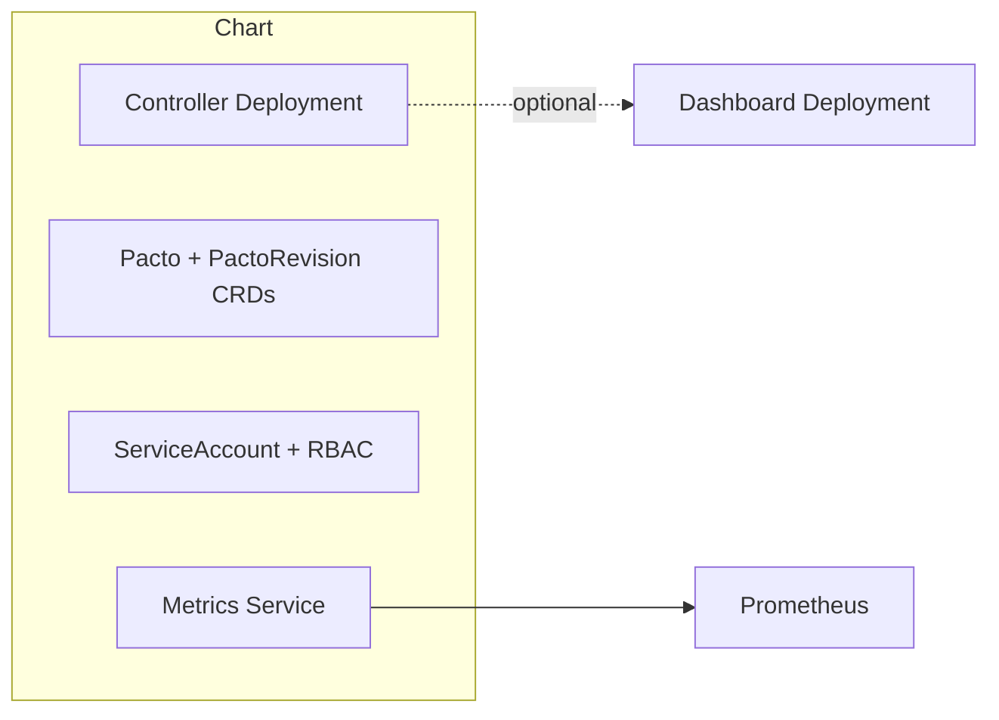

# pacto-operator

    [](https://artifacthub.io/packages/search?repo=pacto-operator)

Kubernetes operator for Pacto service contract validation

## Index

- [Overview](#overview)
- [Architecture](#architecture)
- [Installation](#installation)
- [Upgrade and Compatibility](#upgrade-and-compatibility)
- [CRDs](#crds)
- [Dashboard](#dashboard)
- [Metrics and Observability](#metrics-and-observability)
- [Security](#security)
- [Values](#values)
- [Artifact Verification](#artifact-verification)
- [Maintainers](#maintainers)

## Overview

This chart deploys the [Pacto Operator](https://github.com/TrianaLab/pacto-operator) — a Kubernetes operator that validates running workloads against declared [Pacto](https://github.com/TrianaLab/pacto) service contracts.

What the chart installs:

- Controller `Deployment` with health and readiness probes
- `ServiceAccount`, `ClusterRole`, and `ClusterRoleBinding` for RBAC
- Metrics `Service` (HTTPS by default on port 8443)
- CRDs: `Pacto` and `PactoRevision` (from the `crds/` directory)
- Optional: Prometheus `ServiceMonitor` and `PrometheusRule`

The operator is read-only — it never modifies your workloads. It only reads cluster state and reports compliance.

## Architecture



The chart installs the controller and its supporting resources. The dashboard and Prometheus integration are optional features controlled by values.

## Installation

```bash
helm install pacto-operator oci://ghcr.io/trianalab/charts/pacto-operator \
  --namespace pacto-operator-system --create-namespace
```

Pin to a specific version:

```bash
helm install pacto-operator oci://ghcr.io/trianalab/charts/pacto-operator \
  --version 0.1.0 \
  --namespace pacto-operator-system --create-namespace
```

## Upgrade and Compatibility

- The chart version tracks the operator version. A chart upgrade includes the corresponding controller update.
- CRDs are managed via the `crds/` directory. Helm installs CRDs before other resources but does **not** upgrade or delete them automatically. To update CRDs, apply them manually: `kubectl apply -f charts/pacto-operator/crds/`.
- See the [release notes](https://github.com/TrianaLab/pacto-operator/releases) for breaking changes between versions.

## CRDs

CRDs are installed automatically from the `crds/` directory on first install. Helm does not delete CRDs on `helm uninstall` (by design) to prevent accidental data loss.

## Dashboard

The dashboard is **enabled by default**. The operator manages the dashboard Deployment, internal Service (`pacto-dashboard`, ClusterIP), ServiceAccount, and RBAC. The dashboard image version is automatically determined by the Pacto library version bundled into the controller — it is not user-configurable.

The chart creates a separate exposure Service (`<release>-pacto-operator-dashboard`) with configurable type, plus optional Ingress and HTTPRoute resources. The operator owns the lifecycle; the chart owns the networking. These are distinct concerns:

| Resource | Managed by | Purpose |
|----------|-----------|---------|
| `pacto-dashboard` Service | Operator | Internal ClusterIP, always present when dashboard is enabled |
| `<release>-pacto-operator-dashboard` Service | Chart | Configurable type (ClusterIP/NodePort/LoadBalancer), backend for Ingress/HTTPRoute |
| Ingress | Chart | Optional, references the chart-managed Service |
| HTTPRoute | Chart | Optional, references the chart-managed Service. When `rules` is empty, a catch-all rule routes all traffic to the dashboard |

To disable the dashboard:

```yaml
dashboard:
  enabled: false
```

### Accessing the dashboard

**Port-forward** (default, no extra config):

```bash
kubectl port-forward svc/<release>-pacto-operator-dashboard 3000:3000 -n pacto-operator-system
```

**NodePort**:

```yaml
dashboard:
  service:
    type: NodePort
    nodePort: 30300
```

**LoadBalancer**:

```yaml
dashboard:
  service:
    type: LoadBalancer
```

**Ingress**:

```yaml
dashboard:
  ingress:
    enabled: true
    className: nginx
    hosts:
      - host: pacto.example.com
        paths:
          - path: /
            pathType: Prefix
    tls:
      - secretName: pacto-tls
        hosts:
          - pacto.example.com
```

**HTTPRoute (Gateway API)**:

```yaml
dashboard:
  httpRoute:
    enabled: true
    parentRefs:
      - name: main-gateway
        namespace: gateway-system
    hostnames:
      - pacto.example.com
```

The dashboard is always deployed into the release namespace. Its observation scope is inherited from `controller.watchNamespace` — there is no separate dashboard scope configuration.

### Observation Scope

By default, the controller watches **all namespaces**. To restrict it to a single namespace:

```yaml
controller:
  watchNamespace: production
```

The dashboard inherits this scope automatically.

## Metrics and Observability

The controller exposes Prometheus metrics via OpenTelemetry. By default, the metrics endpoint is served over HTTPS on port 8443.

| Metric | Type | Description |
|--------|------|-------------|
| `pacto_contract_compliance_status` | Gauge | 1 = compliant, 0 = non-compliant |
| `pacto_contract_validation_errors` | Gauge | Count of error-severity failures |
| `pacto_contract_validation_warnings` | Gauge | Count of warning-severity mismatches |
| `pacto_contract_validation_result` | Gauge | Per-check result (1=pass, 0=fail) |

Enable a Prometheus ServiceMonitor:

```yaml
metrics:
  serviceMonitor:
    enabled: true
```

Enable alerting rules:

```yaml
metrics:
  prometheusRule:
    enabled: true
```

## Security

The chart follows security best practices by default:

- Runs as non-root (UID 65532, distroless base image)
- Read-only root filesystem
- All capabilities dropped
- Seccomp profile set to `RuntimeDefault`
- Metrics endpoint served over HTTPS with authentication

## Artifact Verification

The Helm chart and controller image are signed with [Cosign](https://docs.sigstore.dev/cosign/overview/) using keyless (OIDC) signing.

```bash
cosign verify \
  --certificate-oidc-issuer https://token.actions.githubusercontent.com \
  --certificate-identity-regexp 'github\.com/TrianaLab/pacto-operator' \
  ghcr.io/trianalab/charts/pacto-operator:<version>
```

## Values

| Key | Type | Default | Description |
|-----|------|---------|-------------|
| affinity | object | `{}` | Affinity rules for the controller pod |
| controller.watchNamespace | string | `""` | Restrict the controller's observation scope to a single namespace. Empty string (default) means cluster-wide: the controller watches all namespaces. The dashboard inherits this scope automatically. |
| dashboard.enabled | bool | `true` | Enable the operator-managed dashboard deployment. The dashboard image is controlled by the operator and derived from the bundled Pacto library version. It is not user-configurable. |
| dashboard.httpRoute.enabled | bool | `false` | Enable Gateway API HTTPRoute for the dashboard |
| dashboard.httpRoute.hostnames | list | `[]` | Hostnames for the HTTPRoute |
| dashboard.httpRoute.parentRefs | list | `[]` | Parent gateway references |
| dashboard.httpRoute.rules | list | `[]` | HTTPRoute rules. When empty, a single catch-all rule is generated that routes all traffic to the chart-managed dashboard Service on dashboard.service.port. |
| dashboard.ingress.annotations | object | `{}` | Ingress annotations |
| dashboard.ingress.className | string | `""` | Ingress class name |
| dashboard.ingress.enabled | bool | `false` | Enable Ingress for the dashboard |
| dashboard.ingress.hosts | list | `[{"host":"pacto-dashboard.local","paths":[{"path":"/","pathType":"Prefix"}]}]` | Ingress hosts |
| dashboard.ingress.tls | list | `[]` | Ingress TLS configuration |
| dashboard.ociSecret | string | `""` | Optional Secret name for OCI registry credentials (keys: username, password, token) |
| dashboard.service.nodePort | string | `""` | Node port (only used when type is NodePort) |
| dashboard.service.port | int | `3000` | Dashboard service port |
| dashboard.service.type | string | `"ClusterIP"` | Dashboard exposure Service type (ClusterIP, NodePort, LoadBalancer). The operator manages an internal ClusterIP Service (pacto-dashboard) for pod-to-pod communication. This chart-managed Service provides configurable external access and serves as the backend for Ingress/HTTPRoute resources. Selects dashboard pods via operator-defined labels. |
| fullnameOverride | string | `""` | Override the full release name |
| image.pullPolicy | string | `"IfNotPresent"` | Image pull policy |
| image.repository | string | `"ghcr.io/trianalab/pacto-operator/pacto-controller"` | Controller image repository |
| image.tag | string | `""` | Overrides the image tag (default is the chart appVersion) |
| imagePullSecrets | list | `[]` | Image pull secrets for private registries |
| leaderElection.enabled | bool | `true` | Enable leader election for HA deployments |
| metrics.enabled | bool | `true` | Enable the metrics endpoint |
| metrics.prometheusRule.enabled | bool | `false` | Create PrometheusRule for alerting |
| metrics.secure | bool | `true` | Serve metrics over HTTPS |
| metrics.service.port | int | `8443` | Metrics service port |
| metrics.serviceMonitor.enabled | bool | `false` | Create a Prometheus ServiceMonitor |
| metrics.serviceMonitor.interval | string | `""` | Scrape interval |
| metrics.serviceMonitor.scrapeTimeout | string | `""` | Scrape timeout |
| nameOverride | string | `""` | Override the chart name |
| nodeSelector | object | `{}` | Node selector for the controller pod |
| podAnnotations | object | `{}` | Annotations to add to the controller pod |
| podLabels | object | `{}` | Labels to add to the controller pod |
| podSecurityContext.runAsNonRoot | bool | `true` | Run pod as non-root |
| podSecurityContext.seccompProfile.type | string | `"RuntimeDefault"` | Seccomp profile type |
| replicaCount | int | `1` | Number of controller replicas |
| resources.limits.cpu | string | `"500m"` | CPU limit |
| resources.limits.memory | string | `"128Mi"` | Memory limit |
| resources.requests.cpu | string | `"10m"` | CPU request |
| resources.requests.memory | string | `"64Mi"` | Memory request |
| securityContext.allowPrivilegeEscalation | bool | `false` | Disallow privilege escalation |
| securityContext.capabilities.drop | list | `["ALL"]` | Drop all capabilities |
| securityContext.readOnlyRootFilesystem | bool | `true` | Read-only root filesystem |
| securityContext.runAsNonRoot | bool | `true` | Run as non-root |
| securityContext.runAsUser | int | `65532` | Run as UID 65532 (nonroot in distroless) |
| serviceAccount.annotations | object | `{}` | Annotations to add to the ServiceAccount |
| serviceAccount.automount | bool | `true` | Automount API credentials |
| serviceAccount.create | bool | `true` | Create a ServiceAccount for the controller |
| serviceAccount.name | string | `""` | Name override (defaults to fullname) |
| tolerations | list | `[]` | Tolerations for the controller pod |

## Maintainers

| Name | Email | Url |
| ---- | ------ | --- |
| edu-diaz | <edudiazasencio@gmail.com> | <https://edudiaz.dev> |
